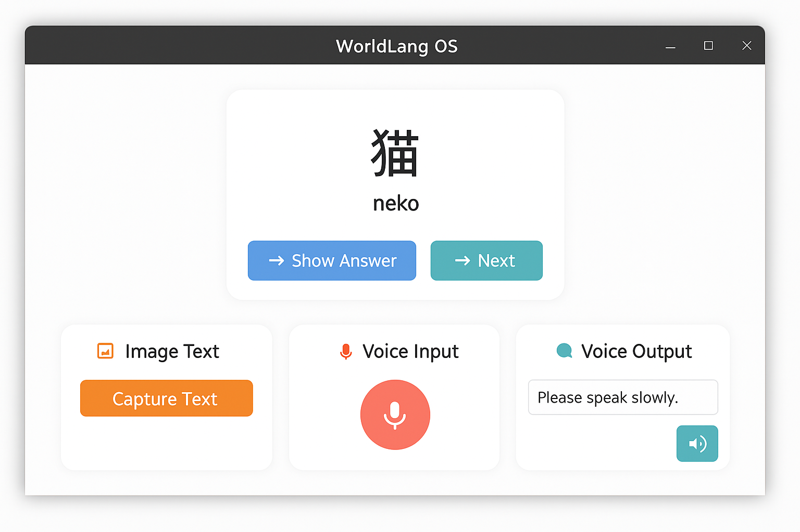

# 🌐 WorldLang OS

**WorldLang OS** is a beautiful, offline-first, cross-platform language learning suite built with open-source technologies.  
It includes flashcards, grammar correction, translation, OCR, and voice I/O — all without requiring an internet connection.

> Learn anywhere. No tracking. No subscriptions. Just pure offline learning.

---

## ✨ Features

- 📚 **Flashcards** with spaced repetition
- 🧠 **AI voice assistant** (speech-to-text + text-to-speech)
- 🔤 **Grammar checking** via LanguageTool
- 🌐 **Multi-language translation** with API fallback
- 🖼️ **OCR support** for extracting text from images
- 🧩 **Modular**: CLI tools, desktop GUI, and scripting all supported
- 🖥️ **Cross-platform**: Works on Linux, macOS, and Windows

---

## 🖼️ UI Preview



---

## 🧰 Tech Stack

| Component        | Language / Tool     | Purpose                                  |
|------------------|---------------------|------------------------------------------|
| **GUI**          | Tauri + JS/HTML/CSS | Desktop app interface                    |
| **Core Engine**  | Rust                | Backend for language/flashcard logic     |
| **OCR**          | Python + Tesseract  | Extract text from images                 |
| **Voice I/O**    | Python + Whisper/Coqui | Speech recognition + TTS              |
| **Grammar**      | Python + LanguageTool | Grammar feedback                       |
| **CLI Tools**    | C++, Python         | Terminal-friendly interface              |
| **Installer**    | Bash                | Cross-platform install script            |

---

## 🚀 Getting Started

```bash
git clone https://github.com/yourusername/worldlang-os
cd worldlang-os
bash scripts/install.sh
bash scripts/launch.sh
```

---

## 🛠️ Roadmap

See [`docs/roadmap.md`](docs/roadmap.md)

- [x] Flashcard system MVP
- [x] Cross-platform GUI layout
- [ ] Full voice assistant support
- [ ] Offline grammar checker
- [ ] Multi-language support (10+)
- [ ] App store packaging

---

## 📜 License

MIT License — Free for personal and commercial use.

---

## 🙋‍♂️ Made by Azrael  
_The future richest man alive._ 👑
